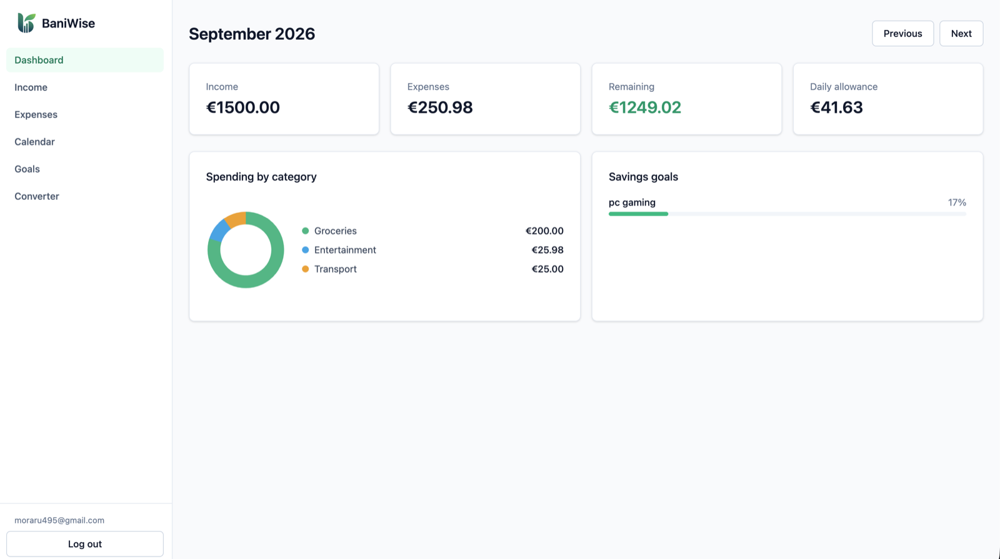
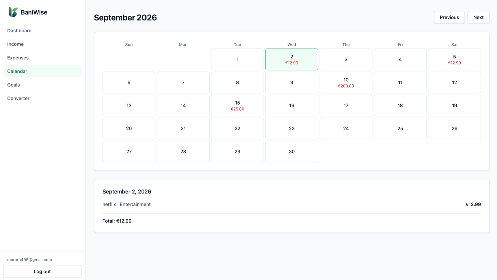
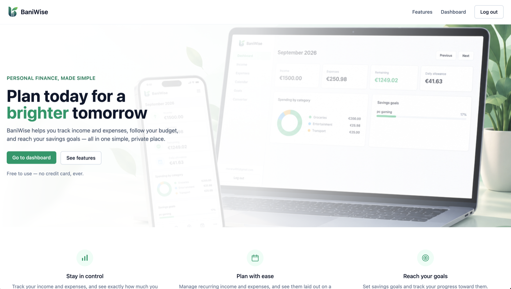
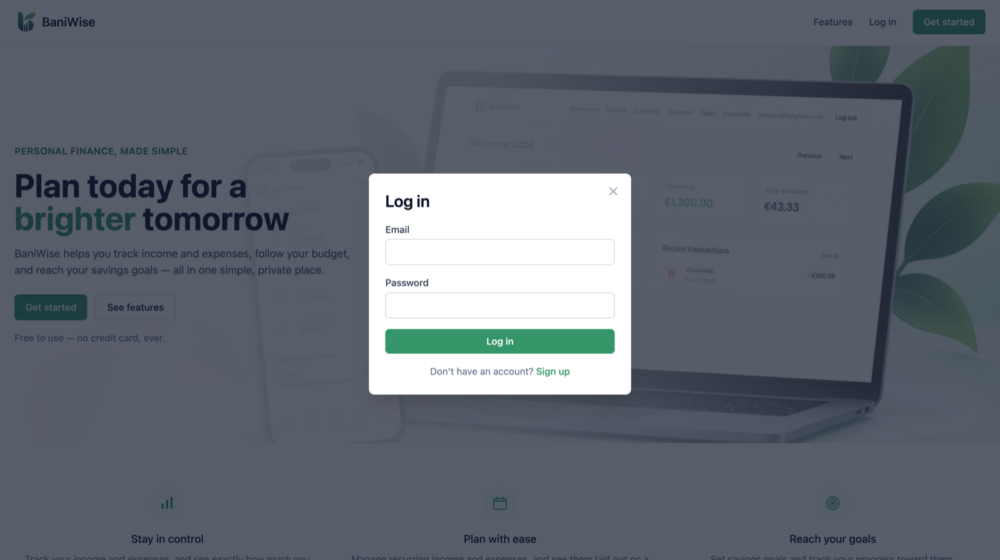

# BaniWise

A personal finance and budget planning app. Track your income and expenses,
see how much you have left to spend, follow your savings goals, and check
what's due on a given day — all in one place.

**Live:** [bani-wise.vercel.app](https://bani-wise.vercel.app)

## Screenshots

| | |
|---|---|
|  |  |
|  |  |

## What it does

- **Authentication** — sign up, log in, log out with a real session
- **Income & Expenses** — add, edit, delete; support for one-time and
  recurring entries (weekly, monthly, yearly)
- **Dashboard** — monthly income, expenses, remaining budget, a daily
  spending allowance, and a breakdown of spending by category
- **Calendar** — see exactly which days your expenses fall on and the
  total for any given day
- **Savings goals** — set a target, track progress with a visual bar, and
  get a rough estimate of when you might reach it
- **Currency converter** — a small standalone tool using a live exchange
  rate API

BaniWise only organizes and calculates the numbers you give it. It is
**not** a financial advisor, and estimates (like the savings goal
timeline) are just that — estimates, not advice.

## Tech stack

- **React + TypeScript + Vite** — the frontend
- **Tailwind CSS** — styling
- **React Router** — client-side routing, including protected routes
- **Supabase** — Postgres database, authentication, and Row Level
  Security (no separate backend server was needed)
- **Frankfurter API** — free, no-key exchange rate API for the currency
  converter

No Redux, no Express backend, no calendar library — I tried to only add
what the project genuinely needed instead of reaching for the "usual"
tools by default.

## Security notes

Every table is protected with Postgres Row Level Security: a logged-in
user can only see and modify their own income, expenses, and savings
goals — enforced by the database itself, not just by the frontend code.

## Running it locally

```bash
npm install
cp .env.example .env   # then fill in your own Supabase project URL + key
npm run dev
```

You'll need your own free [Supabase](https://supabase.com) project. The
database schema (tables, security policies) is in `supabase/schema.sql` —
run it in the Supabase SQL editor.

## Project structure

```
src/
  components/   reusable UI pieces (Button, Card, forms, ...)
  pages/        one file per route (Dashboard, Income, Calendar, ...)
  layouts/      the shared app shell (header, navigation)
  context/      auth session state, shared app-wide
  hooks/        custom hooks (useIncome, useExpenses, useAuth, ...)
  services/     talks to Supabase (or, for the converter, an external API)
  utils/        pure calculation functions (budget, calendar, savings)
  types/        shared TypeScript types
```
